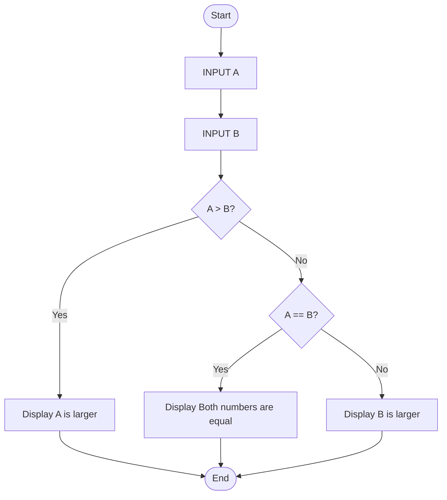
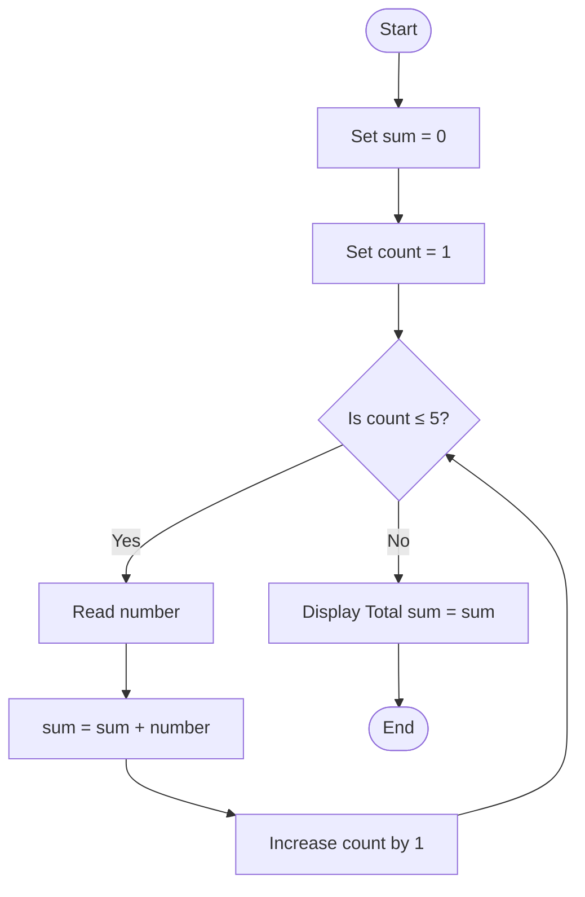
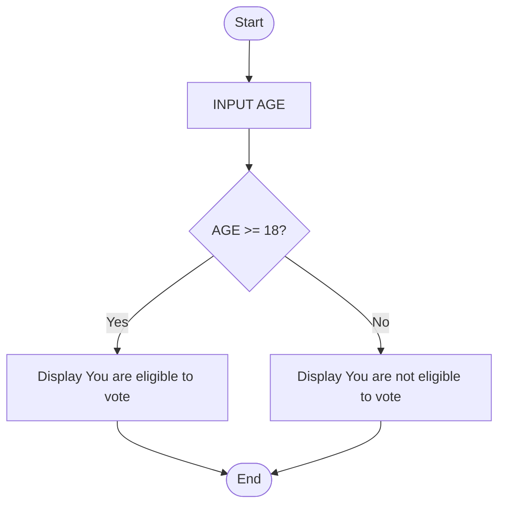
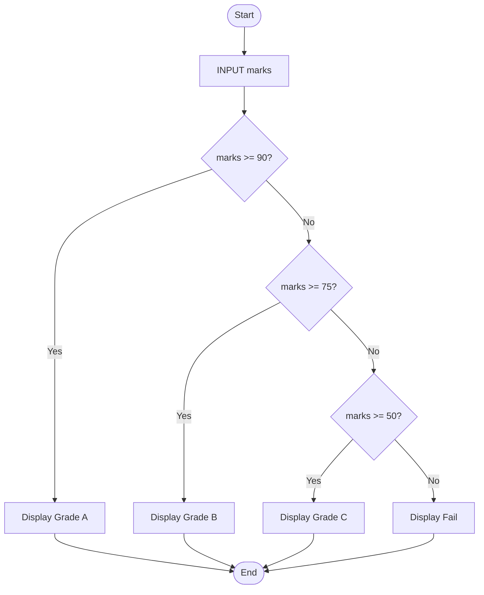
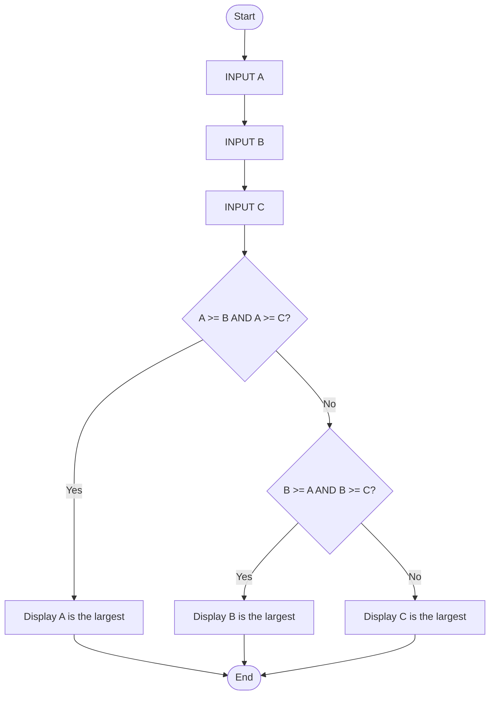

# Exercise: Algorithm and flowchart

## Exercise 1
Find the Largest of Two Numbers

Write a program that:
- Takes two numbers **A** and **B** as input
- Compare the two numbers
- Display which number is larger
- if they are equal, display: **Both numbers are equal**

## Pseudocode
 
```text
START
    INPUT A,B
    IF A > B THEN
        DISPLAY "A is larger"
    ELSE 
    IF A==B THEN
        DISPLAY "Both numbers are equal"
    ELSE
        DISPLAY " B is larger"
    ENDIF
END
```

## Flowchart


```mermaid
flowchart TD
    A([Start]) --> B[INPUT A]
    B --> C[INPUT B]
    C --> D{A > B?}
    
    D -->|Yes| E[Display A is larger]
    D -->|No| F{A == B?}
    
    F -->|Yes| G[Display Both numbers are equal]
    F -->|No| H[Display B is larger]
    
    E --> I([End])
    G --> I([End])
    H --> I([End])
```

## Exercise 2
Sum of 5 Numbers ( Loop + Accumulation)

Write pseudocode for a program that:
- Read 5 numbers one by one
- calculate the total sum
- Display the results


## Pseudocode

```text
START
    SET sum ← 0
    FOR count ← 1 TO 5 DO
        DISPLAY "Enter number ", count
        READ number
        sum ← sum + number
    END FOR

    DISPLAY "Total sum = ", sum
END
```

## Flowchart

```mermaid
flowchart TD

    A([Start]) --> B[Set sum = 0]
    B --> C[Set count = 1]
    C --> D{Is count ≤ 5?}

    D -->|Yes| E[Read number]
    E --> F[sum = sum + number]
    F --> G[Increase count by 1]
    G --> D

    D -->|No| H[Display Total sum = sum]
    H --> I([End])
```

## Exercise 3
Voting Eligibility Check

Write a program that:
- Takes the user's age as input
- If the age is 18 or older, display "You are eligible to vote"
- If the age is less than 18, display "You are not eligible to vote"

## Pseudocode

```text
START
    INPUT AGE

    IF AGE >= 18 THEN
        DISPLAY "You are eligible to vote"
    ELSE
        DISPLAY "You are not eligible to vote"
    ENDIF
END
```

## Flowchart


```mermaid
flowchart TD
    A([Start]) --> B[INPUT AGE]
    B --> C{AGE >= 18?}
    
    C -->|Yes| D[Display You are eligible to vote]
    C -->|No| E[Display You are not eligible to vote]
    
    D --> F([End])
    E --> F([End])
```
## Exercise 4
Student Grade Calculator

Write a program that:
- Takes a student's marks (out of 100) as input
- If marks are 90 or above, display "Grade A"
- If marks are between 75 and 89, display "Grade B"
- If marks are between 50 and 74, display "Grade C"
- If marks are below 50, display "Fail"

## Pseudocode

```text
START
    INPUT marks

    IF marks >= 90 THEN
        DISPLAY "Grade A"
    ELSE IF marks >= 75 THEN
        DISPLAY "Grade B"
    ELSE IF marks >= 50 THEN
        DISPLAY "Grade C"
    ELSE
        DISPLAY "Fail"
    ENDIF
END
```

## Flowchart


```mermaid
flowchart TD
    A([Start]) --> B[INPUT marks]
    B --> C{marks >= 90?}
    
    C -->|Yes| D[Display Grade A]
    C -->|No| E{marks >= 75?}
    
    E -->|Yes| F[Display Grade B]
    E -->|No| G{marks >= 50?}
    
    G -->|Yes| H[Display Grade C]
    G -->|No| I[Display Fail]
    
    D --> J([End])
    F --> J
    H --> J
    I --> J
```

## Exercise 5
Find the Largest of Three Numbers

Write a program that:
- Takes three numbers (A, B, C) as input
- Determine which number is the largest
- Display the largest number

## Pseudocode

```text
START
    INPUT A
    INPUT B
    INPUT C

    IF A >= B AND A >= C THEN
        DISPLAY "Largest number is A =", A
    ELSE IF B >= A AND B >= C THEN
        DISPLAY "Largest number is B =", B
    ELSE
        DISPLAY "Largest number is C =", C
    ENDIF
END
```

## Flowchart


```mermaid
flowchart TD
    A([Start]) --> B[INPUT A]
    B --> C[INPUT B]
    C --> D[INPUT C]
    
    D --> E{A >= B AND A >= C?}
    E -->|Yes| F[Display A is the largest]
    E -->|No| G{B >= A AND B >= C?}
    
    G -->|Yes| H[Display B is the largest]
    G -->|No| I[Display C is the largest]
    
    F --> J([End])
    H --> J
    I --> J
```
